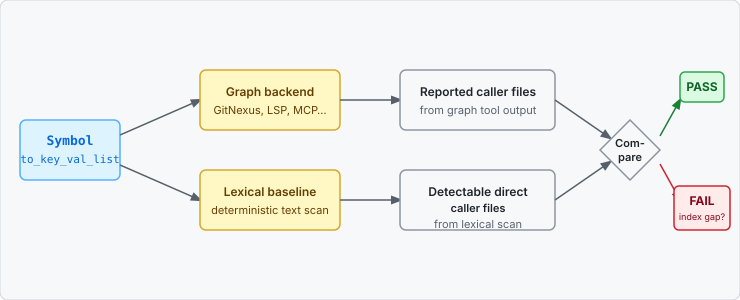
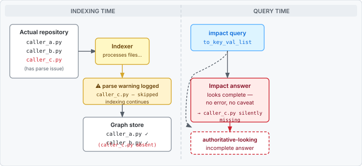

# impact-audited

[](https://github.com/klmtseng/impact-audited/actions/workflows/ci.yml)

Detect silent indexing gaps in code-graph tools.

Verification you didn't ask for
beats confidence you can't check.



## Problem

Code-intelligence tools -- knowledge-graph indexers, LSP-backed "blast radius"
analyzers, MCP servers that give AI agents a map of your codebase -- answer
*"what breaks if I change this function?"*. But if the indexer silently drops a
source file, every dependency edge through that file disappears. You get *"low
risk, only one caller"* when the symbol is used across the core of your codebase.

When a file fails to parse or index, the indexer typically logs a warning and
continues. The file and its edges are absent from the graph. Every subsequent
impact query looks authoritative -- no error, no caveat -- but it returns an
**authoritative-looking incomplete answer**: a result that passes visual
inspection but is missing callers you care about.



## 30-second example

```
Graph backend:

caller_a.py
caller_b.py

Lexical baseline:

caller_a.py
caller_b.py
caller_c.py

FAIL

Missing caller:
caller_c.py
```

## How it works

`impact-audited` cross-checks any graph tool's impact output against a
deterministic lexical baseline -- a text scan for direct call sites.
**The disagreement is the signal**: if the baseline finds a caller the graph
missed, that edge is missing from the index, and you're told so loudly.

The central idea is not grep.

The central idea is that disagreement between two independent analyses is itself valuable evidence.

Deterministic floor (grep, direct callers) + opaque richer layer (graph tool,
transitive impact, risk ranking) + independent confirmation net (the diff).

## Why it matters

GitNexus 1.6.3 over two Python libraries, checked against a deterministic lexical baseline:

| Repo | Files silently dropped | Demonstrably incomplete (strict / broad) |
|---|---|---|
| [`psf/requests`](https://github.com/psf/requests) | `models.py`, `sessions.py`, `utils.py` | **50%** (28/56) / 64% |
| [`ranaroussi/yfinance`](https://github.com/ranaroussi/yfinance) | `const.py`, `scrapers/history.py`, `scrapers/quote.py`, `utils.py` | **12%** (7/59) / 39% |

codebase-memory-mcp 0.8.1 had no such gap on either repo. The problem isn't all graph
tools -- it's that some skip files silently and you usually can't tell which.
Full method: [`benchmark/RESULTS.md`](benchmark/RESULTS.md).

## Quick Start

Python 3.9+, standard library only.

```bash
# Install pinned release (recommended)
python -m pip install "git+https://github.com/klmtseng/impact-audited.git@v0.2.1"

# Development install (latest main)
python -m pip install "git+https://github.com/klmtseng/impact-audited.git@main"

impact-audited --help
```

Single-file: `curl -O https://raw.githubusercontent.com/klmtseng/impact-audited/main/impact_audited.py && chmod +x impact_audited.py`. `[tokens]` extra for token accounting.

## Output example

```bash
# With graph backend:
impact-audited to_key_val_list --path /path/to/requests \
  --graph 'gitnexus impact {sym} -r requests'

# Baseline-only:
impact-audited to_key_val_list --path /path/to/requests
```

`--graph` requires exactly one `{sym}` placeholder.
Exit: `0` pass / `2` missing callers / `3` backend failed / `4` invalid config.
`--json` retains v0.1 fields. CI snippet: [`benchmark/RESULTS.md`](benchmark/RESULTS.md).

## Benchmark

Full methodology and raw numbers: [`benchmark/RESULTS.md`](benchmark/RESULTS.md).

## Limitations

- Conservative text scan, not a parser. Same-named methods, comments, strings,
  and method declarations can cause false positives. Multiline or indirect calls
  can be missed.
- JSX detection covers direct `<Symbol />` / `<Symbol>` references in `.jsx`
  and `.tsx`; aliases, re-exports, dynamically selected components, and
  lowercase intrinsic elements are not resolved semantically.
- Direct caller files only. No transitive impact, LSP integration, tree-sitter
  semantic analysis, or confidence scoring.
- Graph backend must print source paths to stdout. Repo-root-relative or
  absolute paths are both accepted; bare basenames require uniqueness in the
  repo. Non-zero backend exit status is always a backend failure.
- `.git`, dependency, virtual-environment, cache, build, and distribution
  directories are skipped.
- Benchmark findings are for the tool versions tested and may already be fixed
  upstream; the point is the verification pattern, not any one product.

## FAQ

**Why not just use grep?** Grep gives the floor; the graph tool gives transitive
impact and risk ranking. Running only one side means missing what the other sees.

**What about false positives?** Same-named methods, string literals, and
commented-out code can match. Inspect the flagged file; a FAIL you can explain
beats a silent omission you don't know about.

**Which languages are supported?** Python, Rust, Go, TypeScript (`.ts`, `.tsx`),
JavaScript (`.js`, `.jsx`, `.mjs`, `.cjs`). JSX component references (`<Symbol />`)
are detected in `.tsx`/`.jsx` in addition to call sites.

## License

MIT -- see [LICENSE](LICENSE).
